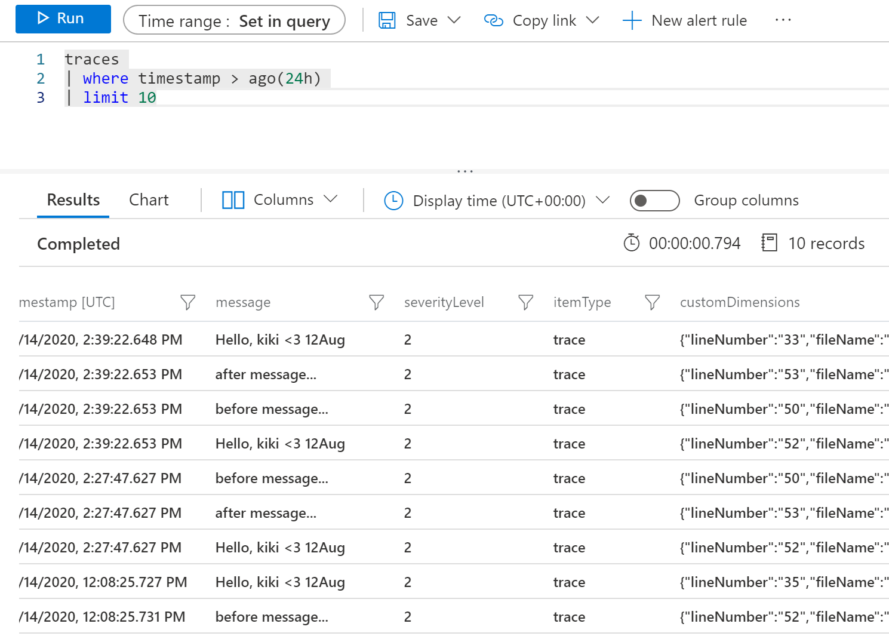

# Opencensus

## Install Dependencies

```
pip install python-dotenv
pip install opencensus
pip install opencensus-ext-logging
pip install opencensus-ext-azure
```

## Create Azure Application Insight
You can follow steps to create Azure Application Insight service on Azure to get an InstrumentationKey 
[Create an Application Insights resource](https://docs.microsoft.com/en-us/azure/azure-monitor/app/create-new-resource) 

## Run the project

I used Python 3.8.2 for this, but it should be fine on other 3.x versions as well.

1. Create a virtual environment  
`python -m venv .venv`

2. Rename the `.env.sample.txt` file to `.env`  
This contains the environment variables that you need to set for your Azure Storage account

3. Set each of the variables in the .env file:  
`APPINSIGHTS_INSTRUMENTATIONKEY`  

4. Install the dependencies  
`pip install -r requirements.txt`

5. Run the project!  
`python azure_opencensus.py`

Result:

